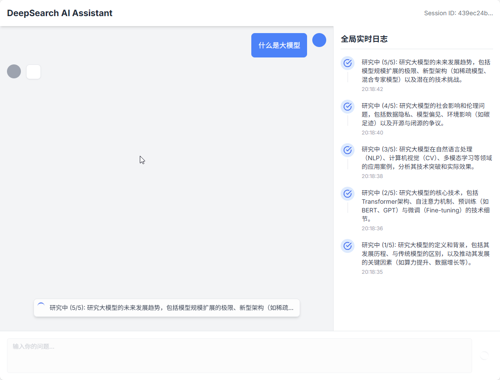
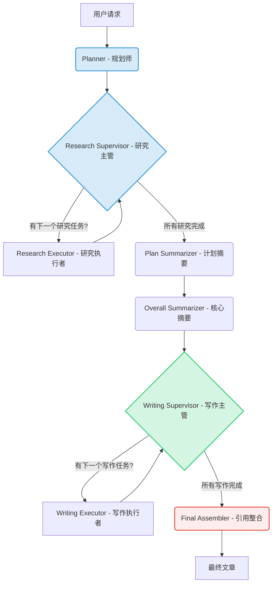

# 🚀 DeepSearch AI Agent

[](https://www.python.org/downloads/)
[](https://reactjs.org/)
[](https://opensource.org/licenses/MIT)

**DeepSearch AI Agent** 是一个高级AI内容创作助手，它基于 **LangGraph** 和 **FastAPI** 构建。与传统的问答机器人不同，它模拟了一个专家团队的工作流，通过“**思考-规划-研究-写作**”的动态循环，将用户的简单请求转化为结构完整、内容深入、叙事自然的专业文章、教程或技术博文。



---

## ✨ 核心特性

- **🧠 动态叙事规划 (Dynamic Narrative Planning)**:
  - **动态思考**: 在规划前，AI会先对主题进行“元认知分析”，判断其类型（技术、历史等）并寻找最佳的“叙事弧”，拒绝生硬模板。
  - **专家级大纲**: 生成的计划章节标题自然、引人入胜，如同真人专家撰写，而非机械的任务描述。

- **🔄 主管-执行者模式 (Supervisor-Executor Pattern)**:
  - **架构清晰**: 采用“研究主管”和“写作主管”分别调度各自的执行者，实现逐任务的研究和写作，确保流程清晰可控。
  - **高可扩展性**: 每个环节都可以轻松加入评审、修正等新节点，实现更复杂的智能代理逻辑。

- **🔗 动态引用与RAG (Dynamic Citations & RAG)**:
  - **精准溯源**: 写作AI通过范围化的RAG工具，只查询与当前章节相关的研究资料，确保信息准确性。
  - **学术级引用**: 自动处理引用，在正文中生成可点击的 `[1]` 标记，并在文末统一生成符合规范的参考文献列表。

- **📡 实时流式通信 (Real-time Streaming Communication)**:
  - **Server-Sent Events**: 后端通过 SSE 将任务进度、新章节内容、参考文献等实时推送至前端。
  - **前端响应式更新**: 前端能够精确解析各类事件，动态更新UI，提供流畅的实时交互体验。

- **🔧 现代化技术栈**:
  - **后端**: FastAPI, LangGraph, LlamaIndex, Pydantic
  - **前端**: React, Vite, TypeScript, Tailwind CSS, shadcn/ui
  - **AI**: 灵活兼容各类大语言模型（DeepSeek, OpenAI, etc.）

---

## 📐 架构解析

项目采用前后端分离架构。其核心是基于 **LangGraph** 构建的、遵循**主管-执行者 (Supervisor-Executor)** 设计模式的事件驱动工作流。

### LangGraph 工作流

此工作流的核心是两个独立的、由主管节点控制的循环（分别用于研究和写作），这使得任务级的进度追踪和模块化操作成为可能。



## 🚀 快速开始

### 1. 克隆仓库

```
git clone <your-repo-url>
cd deepseek_deepsearch_quickstart
```

### 2. 后端设置

a. **创建并激活虚拟环境**:

```
python -m venv venv
# Windows
venv\Scripts\activate
# macOS/Linux
source venv/bin/activate
```

b. **安装依赖**:

```
cd backend
pip install -r requirements.txt
```

c. 配置环境变量:

复制 backend/src/.env.example 为 backend/src/.env，并填入你的 API 密钥。

```
# backend/src/.env

# 用于 RAG 嵌入
DASH_SCOPE_API_KEY=sk-your-dashscope-api-key

# 用于 LLM 推理
DEEPSEEK_API_KEY=sk-your-deepseek-api-key
DEEPSEEK_BASE_URL=[https://api.deepseek.com](https://api.deepseek.com)
```

### 3. 前端设置

```
cd frontend
npm install
```

### 4. 运行应用

a. **启动后端 (终端1)**:

```
cd backend
uvicorn src.api.main:app --host 0.0.0.0 --port 8000 --reload
```

b. **启动前端 (终端2)**:

```
cd frontend
npm run dev
```

现在，在浏览器中打开 `http://localhost:5173`，即可开始体验！

## 📂 项目结构

```
/
├── backend/
│   ├── src/
│   │   ├── api/main.py         # FastAPI 入口
│   │   ├── graphs/             # LangGraph 工作流定义
│   │   ├── prompts/            # 所有 Prompt 模板
│   │   ├── services/           # 外部服务 (LlamaIndex)
│   │   └── ...
│   └── requirements.txt
│
├── frontend/
│   ├── src/
│   │   ├── components/         # 可复用UI组件
│   │   ├── features/           # 核心功能模块 (聊天、日志)
│   │   ├── App.tsx             # 应用主组件
│   │   └── ...
│   └── package.json
│
└── README.md
```